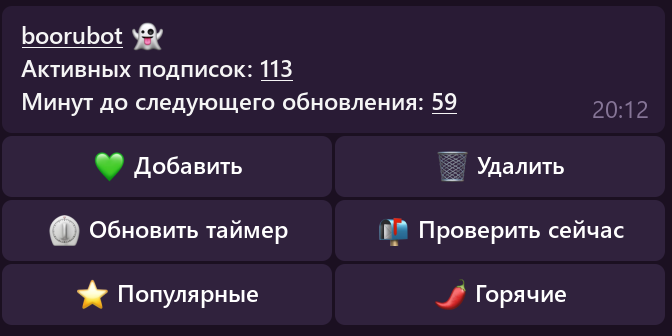

# Персональный Телеграм бот для отслеживания обновлений Danbooru

## Особенности
* Бот предназначен для информирования администратора, подписок для третьих лиц нет
* Подписки и история отправлений хранятся в sqlite
* Подписки это буквально поисковый запрос Danbooru, поэтому нужно использовать актуальные теги и подчёркивания
* Проверка обновлений происходит раз в час
* Крупные файлы загружаются как превью с прямой ссылкой на полный файл

## Пример работы бота



## Установка
Клонируйте репозиторий

```bash
git clone https://github.com/hermanguilliman/boorubot.git
```

Переименуйте .env.example в .env и заполните поля ADMIN id админа и BOT токеном бота

Соберите образ с помощью docker-compose

```bash
docker-compose build
```

Запустите

```bash
docker-compose up -d
```
